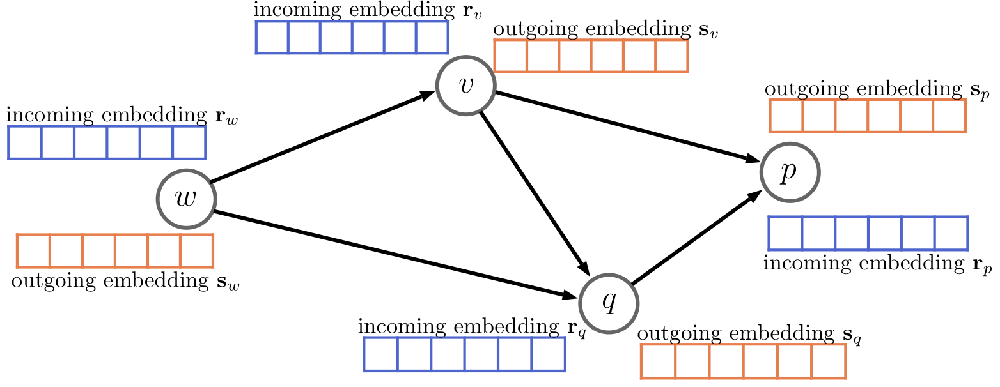
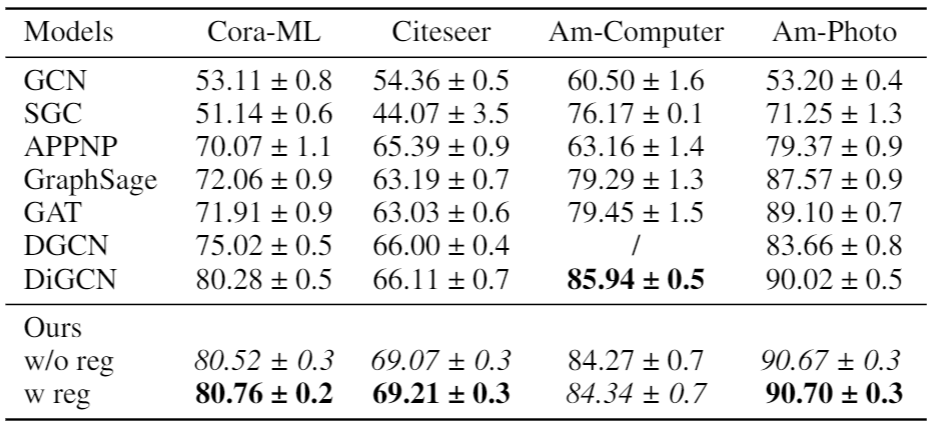

# A noval method of directed graph neural networks

This is the PyTorch implementation of a noval directed graph neural networks, where capture the asymmetric structure of directed graph by modeling the different roles of receiving and sending.

<center> Illustration of the outgoing embedding and the incoming embedding over a four-node toy graph. <center>
<center></center>

## Requirements

Our project is developed using Python 3.7, PyTorch 1.5.0 with CUDA10.2. We recommend you to use [anaconda](https://www.anaconda.com/) for dependency configuration.

Firstly, you need to create an anaconda environment called ```AGNN``` by

```shell
conda create -n AGNN python=3.7
conda activate AGNN
```

Secondly, you need to install pytorch by

```shell
conda install pytorch==1.5.0 torchvision==0.6.0 cudatoolkit=10.2 -c pytorch
```

Thirdly, you need to install [torch-scatter](https://github.com/rusty1s/pytorch_scatter) and [torch-sparse](https://github.com/rusty1s/pytorch_sparse) manually by

```url
https://data.pyg.org/whl/torch-1.5.0%2Bcu102/torch_scatter-2.0.5-cp37-cp37m-linux_x86_64.whl
https://data.pyg.org/whl/torch-1.5.0%2Bcu102/torch_sparse-0.6.7-cp37-cp37m-linux_x86_64.whl
pip install ..
```
You can also install these two packages follow their official instruction.

## Datasets Source

You can download Amazon computers and Amazon photo datasets in the paper [Pitfalls of Graph Neural Network Evaluation](https://www.in.tum.de/daml/gnn-benchmark/):
```url
https://github.com/shchur/gnn-benchmark/tree/master/data/npz
```
And you can download cora_ml and citeseer datasets in [DiGCN](https://github.com/flyingtango/DiGCN):
```url
https://github.com/flyingtango/DiGCN/tree/main/code/data
```
NA dataset can be downloaded in [DAGNN](https://github.com/vthost/DAGNN):
```url
https://github.com/vthost/DAGNN/blob/main/dvae/data/final_structures6.txt
```

After downloading datasets, you should put them to the corresponding folder "code/data/dataset_name/raw", where "dataset_name" should be replaced with the corresponding dataset name (e.g. citeseer).

## Train

### Node-level task
```shell
python ./code/train_node.py --gpu-no 0 --dataset citeseer --epochs 1000 --early_stopping 200 --num_layer 2 --hidden 64 --dropout 0.6 --normalize-features True
python ./code/train_node.py --gpu-no 0 --dataset amazon_photo --epochs 500 --early_stopping 0 --num_layer 2 --hidden 128 --dropout 0.9 normalize-features False
```

### Graph-level task
```shell
python ./code/train_graph.py --gpu-no 0 --model AGNN_share
```

## Results
<center></center>
Overall accuracy comparison on node classification between our AGNN without regularization and AGNN with regularization and seven existing methods. The best results are highlighted in boldface and the second in Italian font.


## Acknowledgements
The template is borrowed from Pytorch-Geometric benchmark suite. We thank the authors of following works for opening source their excellent codes, 
[Pytorch-Geometric](https://github.com/rusty1s/pytorch_geometric),
[GNN-benchmark](https://github.com/shchur/gnn-benchmark),
[DiGCN](https://github.com/flyingtango/DiGCN),
[DAGNN](https://github.com/vthost/DAGNN).
